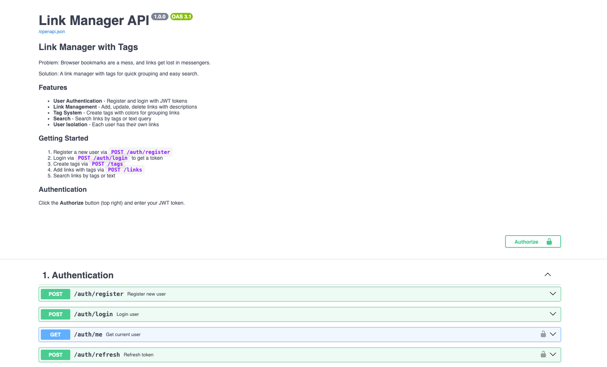
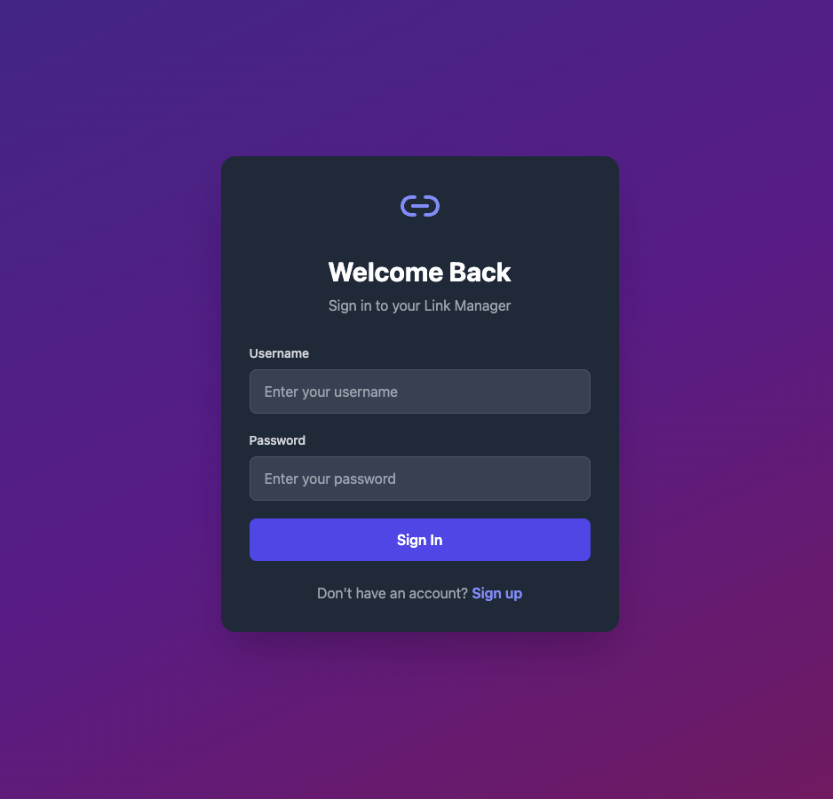
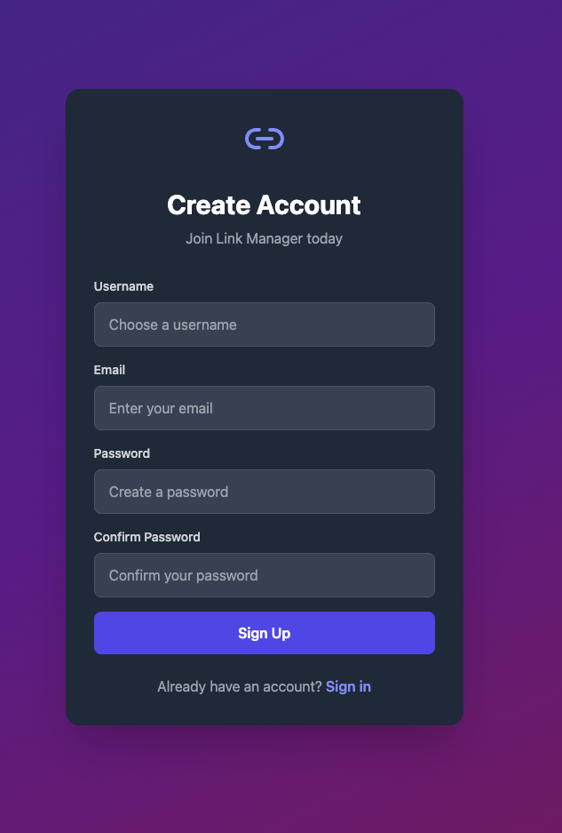
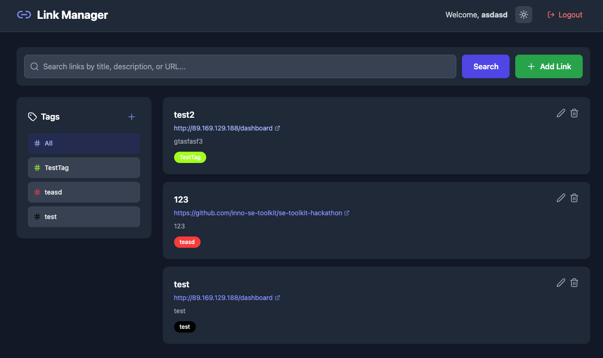
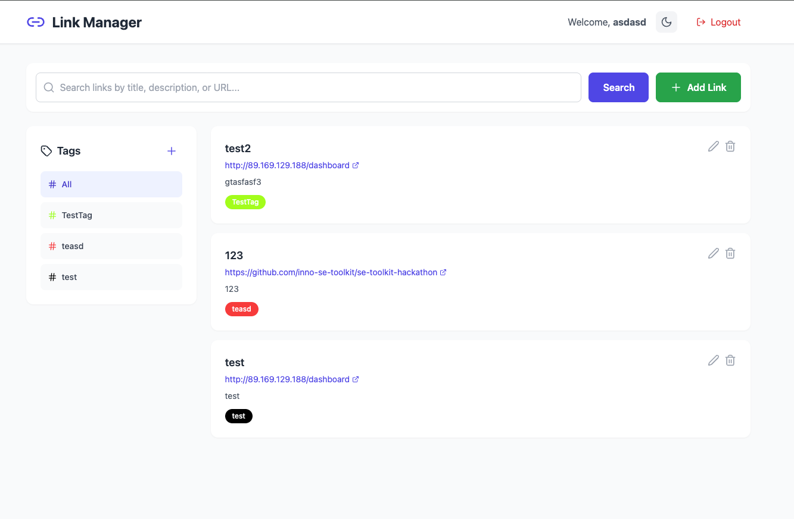
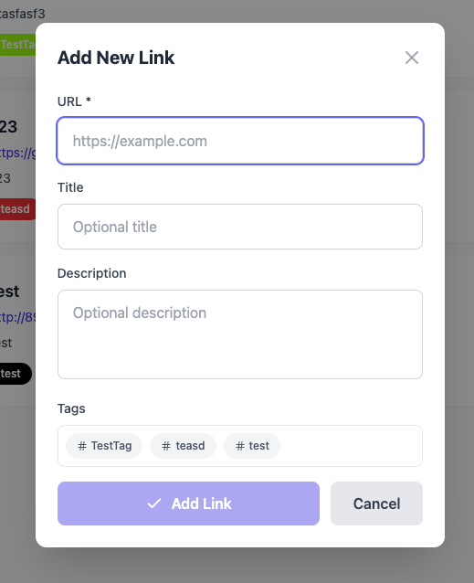
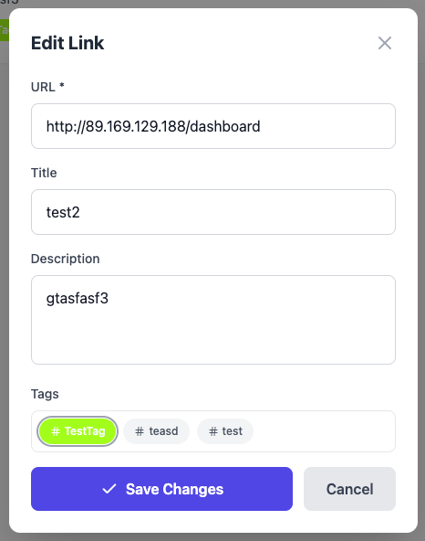
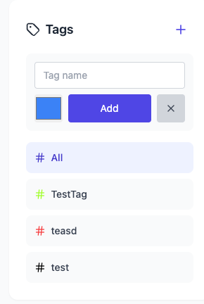

# Link Manager API
A link manager with tags for quick grouping and easy search.

## Demo
| 1. Swagger API Docs | 2. Login Page |
|:---:|:---:|
|  |  |

| 3. Register | 4. Dashboard |
|:---:|:---:|
|  |  |

| 5. Light Theme | 6. Add Link Modal |
|:---:|:---:|
|  |  |

| 7. Edit Link | 8. Tag Management |
|:---:|:---:|
|  |  |

## Product Context

### End Users
* **Students & Researchers:** Managing academic sources, articles, and documentation.
* **Developers:** Organizing technical tutorials, library documentations, and tool references.
* **Content Curators:** Keeping track of inspiration and web resources in one place.

### The Problem
Traditional browser bookmarks and "saved messages" in messengers lead to **digital clutter**. They are difficult to search, lack proper tagging, and often result in lost information or time wasted scrolling through unorganized lists.

### Our Solution: Link Vault
A centralized, high-performance web application that provides:
* **Efficient Organization:** Categorize resources using a flexible tagging system.
* **Instant Retrieval:** Quickly find any saved link through a streamlined dashboard.
* **Modern UX:** A clean, responsive interface with Dark/Light mode support for a seamless workflow.

## Features

- ✅ User registration and authentication (JWT)
- ✅ Link management (CRUD)
- ✅ Tag system with colors
- ✅ Many-to-many relationship: links ↔ tags
- ✅ Search by tags and text query
- ✅ User isolation (each user has their own data)
- ✅ Dark/Light theme toggle
- ✅ Swagger documentation at `/docs`
- ✅ Custom error codes for frontend handling
- ✅ Nginx reverse proxy
- 
## Usage
1. **Deploy**
2. **Access UI:** Open `http://localhost` to use the web app.
3. **Check API:** Open `http://localhost/docs` to verify backend functionality and database connectivity.

## Tech Stack

- **Backend**: FastAPI + SQLAlchemy (async) + PostgreSQL
- **Frontend**: React + TypeScript + Vite + TailwindCSS
- **Database**: PostgreSQL 15
- **Package Manager**: uv (Python)
- **Reverse Proxy**: Nginx
- **Containerization**: Docker + Docker Compose

## Project Structure

```
├── backend/
│   ├── app/
│   │   ├── main.py              # FastAPI application
│   │   ├── config.py            # Settings from .env
│   │   ├── database/            # Async database connection
│   │   ├── models/              # SQLAlchemy models
│   │   ├── schemas/             # Pydantic schemas
│   │   ├── routers/             # API endpoints
│   │   ├── services/            # Business logic
│   │   ├── dependencies/        # Auth dependencies
│   │   └── errors/              # Custom error classes
│   ├── pyproject.toml
│   └── Dockerfile
├── frontend/
│   ├── src/
│   │   ├── api/                 # API client + services
│   │   ├── context/             # Auth + Theme contexts
│   │   ├── pages/               # Login, Register, Dashboard
│   │   └── types/               # TypeScript interfaces
│   ├── package.json
│   └── Dockerfile
├── nginx.conf                   # Nginx reverse proxy config
├── docker-compose.yml
└── .env.example
```

## Getting Started

### Local Development

```bash
docker-compose up --build -d
```

- Frontend: http://localhost:80
- Backend API: http://localhost
- Swagger Docs: http://localhost/docs

## Deployment

### Environment Requirements
* **OS:** Ubuntu 24.04 LTS (recommended) or any modern Linux distribution.
* **Resources:** Minimum 1 vCPU, 2GB RAM.

### Prerequisites
Before deployment, ensure the following tools are installed on your VM:
1. **Git:** `sudo apt update && sudo apt install git -y`
2. **Docker:** [Official Installation Guide](https://docs.docker.com/engine/install/ubuntu/)
3. **Docker Compose:** (Usually included with Docker Desktop or as a plugin `docker-compose-plugin`)

### 📦 Production Deployment Steps

1. **Clone the Repository:**
   ```bash
   git clone [https://github.com/GrigsyChudin/se-toolkit-hackathon.git](https://github.com/GrigsyChudin/se-toolkit-hackathon.git)
   cd se-toolkit-hackathon
   ```
2. **Configure Environment:**
   ```bash
    cp .env.example .env
    # Edit .env with your secrets (JWT_SECRET, POSTGRES_PASSWORD, etc.)
    nano .env
   ```
3. **Build and Launch:**
   ```bash
    docker compose up --build -d
   ```
4. **Access the Application:**
   - Web Client: http://localhost (or your VM IP)*
   - API Docs: http://localhost/docs
   - Health Check: http://localhost/api/health
## API Endpoints

### Authentication
| Method | Endpoint | Description |
|--------|----------|-------------|
| POST | `/auth/register` | Register new user |
| POST | `/auth/login` | Login and get JWT token |
| POST | `/auth/refresh` | Refresh JWT token |
| GET | `/auth/me` | Get current user |

### Tags
| Method | Endpoint | Description |
|--------|----------|-------------|
| GET | `/tags` | Get all user tags |
| POST | `/tags` | Create new tag |
| GET | `/tags/{id}` | Get tag by ID |
| PUT | `/tags/{id}` | Update tag |
| DELETE | `/tags/{id}` | Delete tag |

### Links
| Method | Endpoint | Description |
|--------|----------|-------------|
| GET | `/links` | Get all user links |
| POST | `/links` | Add new link |
| GET | `/links/{id}` | Get link by ID |
| PUT | `/links/{id}` | Update link |
| DELETE | `/links/{id}` | Delete link |
| GET | `/links/search/tags?tags=name` | Search by tags |
| GET | `/links/search/query?q=text` | Search by text |

## Environment Variables

| Variable | Description | Default |
|----------|-------------|---------|
| POSTGRES_USER | PostgreSQL username | postgres |
| POSTGRES_PASSWORD | PostgreSQL password | postgres |
| POSTGRES_DB | Database name | app |
| SECRET_KEY | JWT secret key | your-secret-key-change-in-production |

## Development

### Backend

```bash
cd backend
uv sync
uv run uvicorn app.main:app --reload
```

### Frontend

```bash
cd frontend
npm install
npm run dev
```
